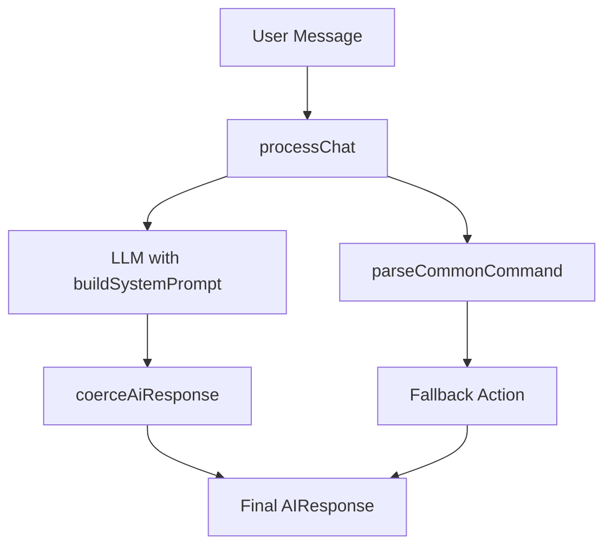

# System Design & Architecture

## Architecture Overview
**What is the high-level system structure?**

- `parseCommonCommand` xử lý intent/date/time theo rule-based parser.
- `buildSystemPrompt` định hướng LLM trả JSON đúng schema và đúng trọng tâm booking.
- `coerceAiResponse` là lớp guardrail cuối để đảm bảo response hợp lệ trước khi route xử lý.

## Data Models
**What data do we need to manage?**

- Không thêm model mới.
- Tiếp tục dùng `AIResponse` union hiện có trong `src/types/index.ts`.
- Dữ liệu phòng lấy từ `config.rooms` để tạo suggestion snippet.

## API Design
**How do components communicate?**

- Không đổi API `/chat`.
- `processChat()` vẫn trả `AIResponse` tương thích route hiện tại.

## Component Breakdown
**What are the major building blocks?**

- `resolveWeekday()`: mở rộng parse weekday tiếng Việt dạng chữ và tiếng Anh.
- `hasSearchIntent()/hasRecommendationIntent()`: nhận diện intent gợi ý phòng.
- `parseCommonCommand()`: clarify tập trung vào field thiếu + gợi ý nhanh.
- `buildSystemPrompt()`: instruction cứng cho luồng booking/recommendation.

## Design Decisions
**Why did we choose this approach?**

- Giữ nguyên schema/action để tránh phá vỡ backend/frontend contract.
- Kết hợp prompt-level steering + code-level guardrails để giảm rủi ro model trả lệch.
- Chỉ mở rộng parser theo phạm vi bug thực tế (weekday/recommendation intent).

### Decision Log
- Decision made: Giữ nguyên action schema hiện tại.
- Alternatives considered: Thêm action mới cho recommendation.
- Objections raised: Có thể cần action riêng để biểu diễn recommendation rõ hơn.
- Resolution and rationale: Không thêm action để đảm bảo backward compatibility; recommendation đi qua search/clarify là đủ.

- Decision made: Mở rộng parse weekday bằng từ tiếng Việt và tiếng Anh.
- Alternatives considered: Chỉ chỉnh prompt, không đổi parser.
- Objections raised: Prompt-only không đủ enforce.
- Resolution and rationale: Chấp nhận objection; parser phải là guardrail cứng.

## Non-Functional Requirements
**How should the system perform?**

- Performance: giữ complexity tuyến tính theo độ dài message, không thêm I/O.
- Reliability: fail-safe sang `clarify` khi thiếu dữ liệu ngày/giờ.
- Maintainability: thay đổi gói gọn trong `ai.service.ts`, không lan module khác.
- Security: không bổ sung truy cập dữ liệu nhạy cảm mới.
