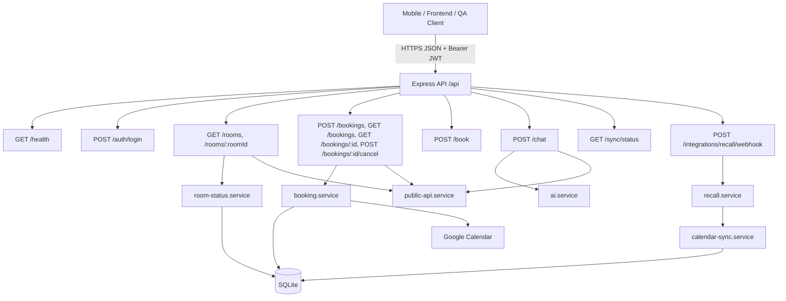

# System Design & Architecture

## Architecture Overview
**What is the high-level system structure?**



- `src/app.ts` là source of truth cho endpoint inventory và mount path.
- Tất cả consumer-facing API trả JSON. Endpoint protected dùng cùng một JWT auth middleware.
- `public-api.service.ts` là lớp chuẩn hóa DTO cho room và booking, nên consumer nên bám theo output của service này thay vì DB schema.
- Webhook Recall sống chung dưới `/api` nhưng là integration endpoint nội bộ, không phải app endpoint.

## Data Models
**What data do we need to manage?**

### Canonical API DTOs

```ts
type BookingStatus = 'pending' | 'confirmed' | 'modified' | 'cancelled' | 'sync_error'
type SyncSource = 'google_calendar' | 'recall' | 'ical_fallback' | 'system'
type SyncHealth = 'healthy' | 'degraded' | 'offline' | 'unknown'

type ErrorResponse = {
  error: string
}

type LoginResponse = {
  token: string
  user: {
    email: string
    name: string
  }
}

type PublicRoomSlot = {
  externalEventId: string
  title: string
  startAt: string
  endAt: string
  date: string
  startTime: string
  endTime: string
  status: string
  source: string
}

type PublicBooking = {
  id: string
  userEmail: string
  roomId: string
  roomName: string
  date: string
  startTime: string
  endTime: string
  startAt: string
  endAt: string
  duration: number
  title: string
  status: BookingStatus
  createdAt: string
  updatedAt: string
  calendarLink: string | null
  calendarEventId: string | null
  source: SyncSource
  notes: string | null
  room?: PublicRoom
}

type PublicRoom = {
  id: string
  name: string
  capacity: number
  floor?: string | number
  description?: string
  image: string | null
  color: string | null
  equipment: string[]
  features: string[]
  timezone: string
  liveStatus: 'busy' | 'reserved' | 'available' | 'syncing' | 'unknown' | string
  currentBooking: PublicBooking | null
  nextBooking: PublicBooking | null
  bookedSlots: PublicRoomSlot[]
}

type SyncStatusView = {
  state: SyncHealth
  lastSuccessfulSyncAt: string | null
  lastAttemptAt: string | null
  pendingChanges: number
  roomsSynced: number
  message: string | null
}
```

### Data Conventions

- `startAt` và `endAt` là source of truth cho time range, luôn nên được parse như ISO timestamp.
- `date`, `startTime`, `endTime` là field convenience đã được format theo `room.timezone`, mặc định là `Asia/Bangkok`.
- `currentBooking` và `nextBooking` trong `PublicRoom` là booking rút gọn, không lồng `room` tiếp để tránh recursive payload.
- `calendarLink`, `calendarEventId`, `notes`, `currentBooking`, `nextBooking`, `room` đều có thể `null` hoặc bị omit tùy ngữ cảnh.

## API Design
**How do components communicate?**

### Endpoint Classification

| Consumer | Endpoints | Auth | Notes |
|---|---|---|---|
| Public diagnostics | `GET /api/health` | No | Health check đơn giản, không có business data |
| Auth bootstrap | `POST /api/auth/login` | No | Đầu vào duy nhất để lấy JWT |
| App/mobile | `GET /api/rooms`, `GET /api/rooms/:roomId` | Yes | Room catalog + live availability |
| App/mobile | `GET /api/bookings`, `GET /api/bookings/:bookingId`, `POST /api/bookings`, `POST /api/bookings/:bookingId/cancel` | Yes | Booking lifecycle chính |
| Legacy app/client | `POST /api/book` | Yes | Legacy alias cho create booking |
| App/mobile assistant | `POST /api/chat` | Yes | Intent endpoint, không trực tiếp persist booking |
| Diagnostics/admin | `GET /api/sync/status` | Yes | Health/debug summary của sync subsystem |
| Server-to-server | `POST /api/integrations/recall/webhook` | Signature-based | Chỉ dành cho Recall webhook |

### Authentication Model

- `POST /api/auth/login` nhận `{ email }` và tạo JWT hết hạn sau 24 giờ.
- Protected endpoint yêu cầu header `Authorization: Bearer <token>`.
- `authMiddleware` chỉ tin vào JWT payload `{ email, name }`.
- Khi token thiếu, sai format, hết hạn hoặc invalid, backend trả `401` với body `{ "error": "..." }`.

### Error Model

- Các route business trả lỗi dạng `{ "error": "<message>" }`.
- `400`: validation/input/time range sai.
- `401`: thiếu token hoặc token invalid/expired.
- `404`: room/booking không tồn tại.
- `409`: slot đã bị chiếm.
- `500`: lỗi hệ thống hoặc external dependency.
- `202`: webhook bị ignore nhưng request vẫn được tiếp nhận ổn định.

## Component Breakdown
**What are the major building blocks?**

- `src/routes/auth.ts`: login contract và JWT issue.
- `src/routes/rooms.ts`: room catalog endpoints.
- `src/routes/booking.ts`: legacy create booking endpoint.
- `src/routes/bookings.ts`: booking REST-like endpoints.
- `src/routes/chat.ts`: intent router cho search/summary/availability.
- `src/routes/sync.ts`: sync health endpoint.
- `src/routes/integrations.ts`: Recall webhook ingestion.
- `src/middleware/auth.ts`: shared Bearer verification.
- `src/services/public-api.service.ts`: canonical output schema cho room/booking.
- `src/services/booking.service.ts`: validation, conflict detection, Google Calendar sync.
- `src/services/room-status.service.ts`: projection-driven room availability.
- `src/services/sync-status.service.ts`: health summary cho sync UI.

## Design Decisions
**Why did we choose this approach?**

- Dùng DTO formatter riêng để contract ổn định hơn raw DB rows.
- Giữ song song `POST /api/book` và `POST /api/bookings` để không phá integration cũ.
- Dùng một `POST /api/chat` duy nhất nhưng response theo discriminated union `type`, giúp app render theo machine-readable contract thay vì parse free text.
- Tách rõ consumer-facing và server-to-server endpoint trong cùng bộ docs để tránh gọi nhầm webhook path.

## Non-Functional Requirements
**How should the system perform?**

- Security requirements
- JWT là bắt buộc cho mọi endpoint có business data.
- Recall webhook dùng signature verification nếu đã cấu hình secret.
- Reliability requirements
- Booking conflict phải map ra `409` rõ ràng.
- Sync health phải trả response ổn định kể cả khi projection hoặc external sync đang degraded.
- Integration correctness requirements
- Consumer phải ưu tiên parse `startAt/endAt` thay vì tự dựng lại từ `date/startTime/endTime`.
- Consumer phải handle field nullable và missing field an toàn.
- Scalability notes
- API hiện chưa versioned; nếu public cho nhiều client dài hạn thì `/api/v1` là hướng nên cân nhắc.
